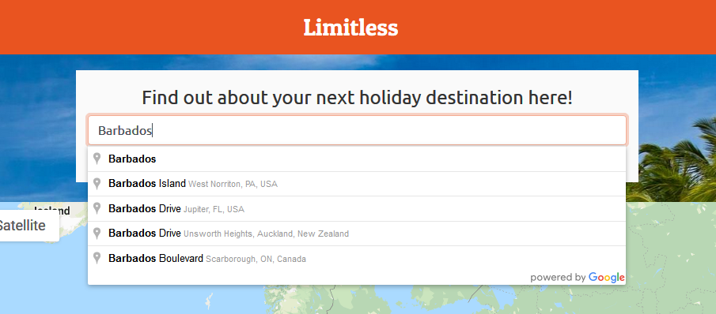
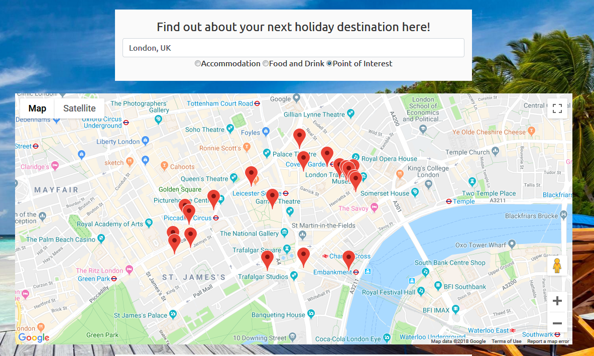
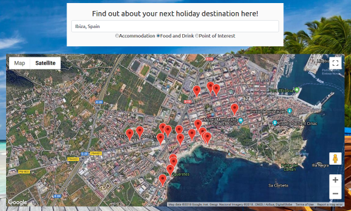
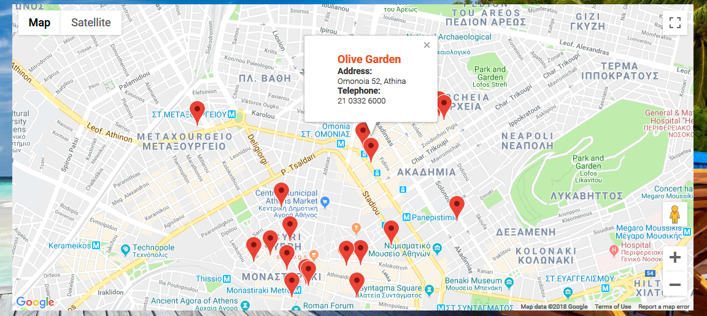
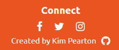

# Limitless - Interactive Frontend Development Milestone Project

This website is available to view here - https://kimpea.github.io/limitless/

This website has been created to allow users to search for a location, specifically their next holiday destination, and to find out more information on the accommodation, food and drink, and points of interest available within the area that they have searched for. With the help of Google Maps JavaScript API, users can obtain this information through pop up windows that are triggered when a radio button has been checked, e.g. when the accommodation radio button is checked, markers will appear on the map displaying accommodation within the area that has been searched for. The Maps API also allows users to view StreetView images and satellite imagery. 
 
## UX 

This website is targeted towards users aiming to travel to a planned destination or towards users who want to find out more about accommodation, places to eat or attractions within an area they are curious about. This type of user will want to know where places to stay and places to eat are, and also points of interest which they may like to visit on their holiday. My project is a suitable way of achieving this because it provides filters for the user to use when they search for a place to visit and also provides them with information such as addresses and telephone numbers of establishments they are interested in. It is an easy-to-use website - all the user has to do is type in their chosen location into the search bar, select a query and a filter, and then select a marker on the map to reveal the information they are seeking. Once they have found what they are looking for, the user can click on the place name in the info window which takes them to Google Maps, providing more information such as photos, reviews and ratings. 

General User Stories:
- As a user type, I want to be able to call up a restaurant in an area I am visiting next month, so that I can book a table.
- As a user type, I would like to be able to find a place to stay with my family in [area name here]. 
- As a user type, I would like to know what attractions there are in [area name here] when I go on holiday there next year. 

Real Life User Stories:
- User 1: I'd like to know what bars and restaurants there are in Almeria for our holiday next year.
- User 2: I want to go away to Barbados for my birthday next year - I'd like to know what hotels or apartments there are which I can stay in.
- User 3: I'm getting bored being at home all the time - I'd like to know what attractions there are in my local area. 

Wireframes:
- [Desktop and laptop wireframe](https://wireframe.cc/JztSx9)
- [Mobile wireframe](https://wireframe.cc/gsisCp)
- [Tablet wireframe](https://wireframe.cc/QXjHIG)

A more detailed documentation of the Five Planes of UX is available [here](documentation/ux_planes.pdf). 

## Features

- Autocomplete search feature -  allowing user to search for a location of their choice and pick from a dropdown of suggestions for more specific search. 
- Radio buttons - allowing user to filter out their search between accommodation, food & drink and points of interest.
- Maps API - allowing user to view markers dropped onto the map for their chosen filter on the location they searched for. 
- Info window - allowing user to view the name of the establishment, address and telephone number
- Social media links - although only for design purposes in this project, this could allow users to follow the 'Limitless' brand on social media if it ever existed
 
### Existing Features
Autocomplete feature allows Users 1, 2 and 3 to search for and select their chosen locations, e.g. Almeria, Barbados or their local area.
(Inset image autocomplete-search here)
- Whilst User 1 will have no trouble searching for 'Almeria' or a specific location, User 2 may not receive accurate results as 'Barbados' is a country and not a town or city.

Radio buttons feature allows Users 1 to filter out places to eat and drink in Almeria, allows User 2 to filter out places to stay in Barbados, and allows User 3 to find points of interest in their local area (if there are any). 

Maps API feature allows all users to have access to the information on the establishments they are most interested in, depending on what filters they have chosen. It allows all the users to use Google StreetView Images and satellite imagery. 

Info window feature gives the user the establishment name, address and telephone number (if available) when the place marker is clicked. The user also has the option to click on the place name and be directed to Google Maps which will provide more information on the chosen establishment, such as photos, reviews, ratings and opening hours. 

Social media links feature allows all users, if they want to, to follow 'Limitless' on Facebook, Twitter and Instagram, however, this is only a design feature for now to make the website appear more user-friendly and welcoming. 

### Features Left to Implement
- Add ratings to the info window on the map
- Add photos of establishments in a separate section underneat the map

These features would mean the user relies more on my website rather than moving onto Google Maps when clicking on the place name link, however, I have left them out for now in order to not further delay and complicate the project. 

## Technologies Used

- [JQuery](https://jquery.com)
    - The project uses **JQuery** to simplify DOM manipulation.
- [JavaScript](https://www.javascript.com/)
    - This project uses **JavaScript** to implement the Google Maps API into the document.
- HTML
    - This project uses **HTML** to build the foundation of the website and include links to CSS and JavaScript scripts.
- CSS
    - This project uses **CSS** to style the features of the website, including the header, footer and the map itself.
- [Bootstrap 4](https://getbootstrap.com/)
    - This project uses **Bootstrap 4** in order to apply a columns, a navbar and to justify content within the HTML document for a clean, fresh look.
- [Bootswatch](https://bootswatch.com/united/)
    - This project uses the **Bootswatch United Theme** to apply the navbar within the header, and also to set the colour scheme of the website.
- [Google Maps JavaScript API](https://developers.google.com/maps/documentation/javascript/tutorial)
    - This project uses the **Google Maps JavaScript API** to allow users to search for accommodation, places to eat and drink, and points of interest in a searched location.
- [Google Places API](https://developers.google.com/places/web-service/intro)
    - This project uses the **Google Places API** Place Autocomplete feature to allow a user's search query to autocomplete.
- [Font Awesome](https://fontawesome.com/)
    - This project uses **Font Awesome** to provide icons for the social media links inside the footer of the page.
- [Wireframe.cc](https://wireframe.cc)
    - This project uses **Wireframe.cc** in the planning.
- [Google Fonts](https://fonts.google.com/)
    - This project uses **Google Fonts** to provide the 'Patua One' font for the heading of the website.
- [Paint.NET](https://www.getpaint.net/)
    - This project uses **Paint.NET** to edit and resize screenshots taken of the website.

## Testing

I tested my website by:
- Using Chrome and Firefox developer tools from the beginning of the projec to the end to test the functionality and responsiveness.
- Using these developer tools to see how the website functioned and looked across different device screen sizes. The testing for this has been recorded [here](documentation/device_test.pdf).
- Having my target audience try out the website on their devices and to gain feedback from them.
- Using different browsers such as Chrome, Firefox and Edge. There were obvious layout issues with older versions of Internet Explorer.
- Validating the code with [W3C Validator](https://validator.w3.org/)

Scenarios for users:
1. Search for location:
    1. Go to the search bar
    2. Click in search bar and verify that the tooltip 'Please fill in this field' is displayed
    3. Enter a country, e.g. Spain, click on the first autocomplete result, choose a filter and verify that the results are inaccurate.
    4. Enter a specific location, e.g. Bridgetown, click on the first autocomplete result, choose a filter and verify that results are accurate.

2. Find out more:
    1. Following on from first scenario, click on any marker and verify an establishment name, address and telephone are provided. 
    2. Repeat this with each filter and verify new markers are dropped onto the map. 

3. Map Features:
    1. Click on 'Satellite' and verify that the map changes from the default layout to satellite view. 
    2. Uncheck 'Labels' when in Satellite mode and verify that labels disappear (and reappear when checking it).
    3. Use Ctrl + Scroll (desktop) and verify that the map zooms in/out. For mobile, use fingers and verify that the map zooms in/out.
    4. Drop the 'Streetview' icon onto the map and verify that an image loads of the place where the icon was dropped.
    5. Click on the fullscreen button (top-right of map) and verify that the map enters fullscreen mode. Press 'esc' to exit this mode. 

Results from scenario tests:
- Users found that searching for a location of their choice was quick and simple to do and noted that it helps having a specific location in mind before carrying out their search in order to receive accurante results from the Map API. 
- Users found that the map markers provided sufficient information on establishments which they were interested in. They suggested that adding a rating feature would be useful too. 
- Users found that the Streetview map feature was very helpful as, rather than finding out more information on establishments in their chosen area, they could also see what the area's environment looked like. 

### Responsiveness

Responsiveness has been tested and recorded [here](documentation/device_test.pdf). 

Screenshots of the website in mobile, tablet and desktop view are here:
- [Mobile - Galaxy 3](documentation/mobile-view.png)
- [Tablet - iPad](documentation/tablet-view.png)
- [Desktop](documentation/desktop-view.png)

Please note that these screenshots are of what the user will see when they first visit the website and that they will be able to scroll to see the bottom of the page.

### Bugs

Device screen size bug - this bug occurred when testing the responsiveness of the website across various device screen sizes. The Kindle Fire HDX, Nexus 10, iPad Pro and iPad Mini all had issues with the footer of the website floating in the middle of the screen. This bug has been fixed with media queries for the Nexus 10 and iPad Pro which ultimately fixed the issue for the Kindle Fire HDX and iPad Mini too. 

## Deployment

This project has been deployed onto GitHub, and can be viewed with GitHub Pages here https://kimpea.github.io/limitless/. 
To run this website locally, you will need to clone or download the repository and then open the index.html in a browser of your choice. 

## Credits
Much of the map.js JavaScript code has been taken from the Google Maps JavaScript API and Places API tutorials, however, has been rendered to fit with my project. I would like to credit https://www.doogal.co.uk/LatLong.php in aiding me with finding the longitude and latitude of Europe for centering the map. I would also like to credit Stack Overflow in helping me solve responsiveness bugs and also explaining why errors occurred with the W3C Validator. 

### Media
- The background photo used in this site was obtained from [this website](https://static.independent.co.uk/s3fs-public/thumbnails/image/2017/04/11/12/package-holiday-credit-grafner.jpg?w968) - iStock/Grafner

### Acknowledgements
- Stack Overflow
- Google Maps JavaScript API

